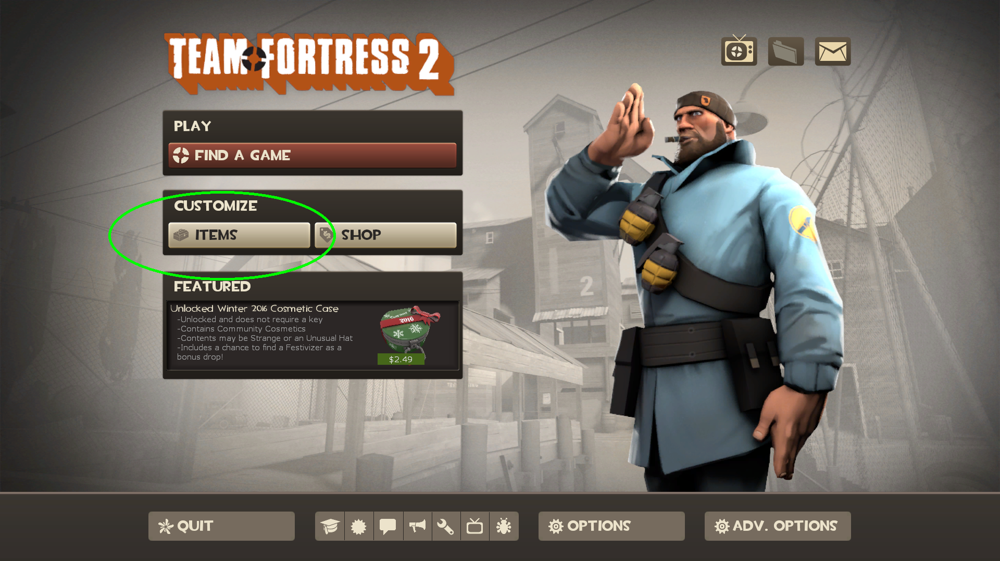
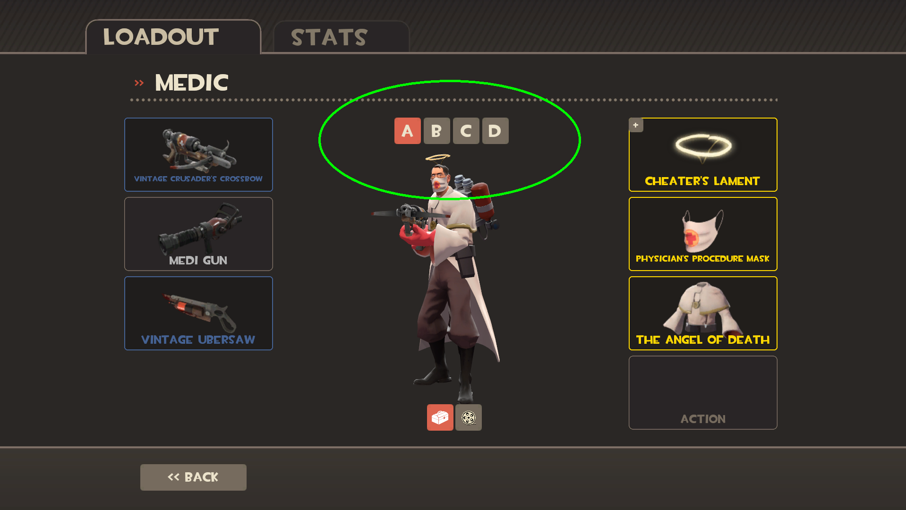
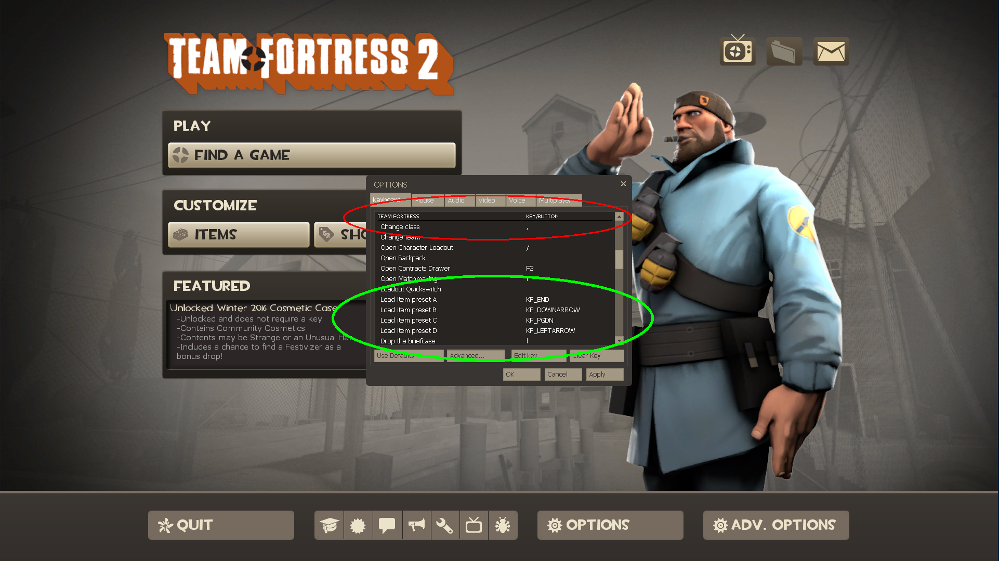
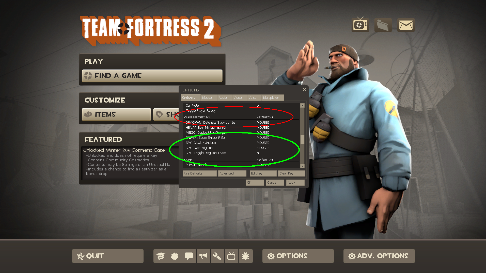
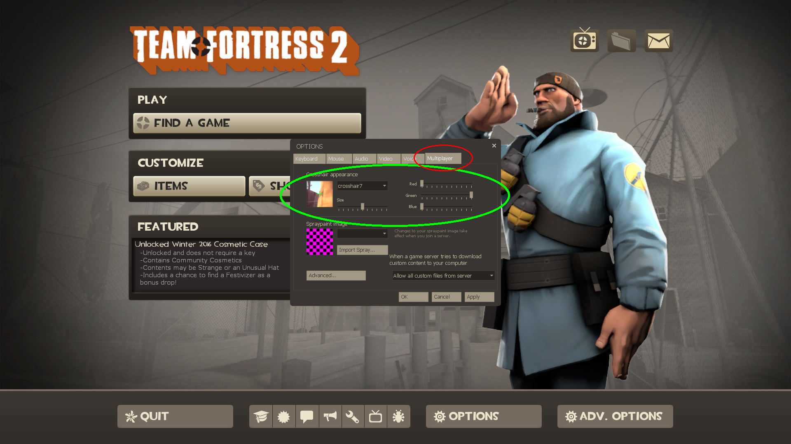

# Options

Configure your options to take advantage of these hidden features.

### Load item preset

From the main menu, if you navigate into Items, you can choose each class and set four item loadouts, or presets for each one.

My first medic loadout 'A' uses the Medi Gun, the second loadout 'B' uses The Kritzkrieg, etc.

In Options, under the category "TEAM FORTRESS", you can assign hotkeys to change between your four loadouts. I set them to my Num Pad's `1`, `2`, `3`, and `4`:

There's a protip using this on the Engineer. For reference I have:

1. Stock sentry
1. Gunslinger mini sentry

Now, when you change your engineer preset between these two, it will destroy your sentry if it's built. But it won't destroy anything else.

The protip is that you can use these hotkeys to quickly resupply in spawn. When you're in spawn and you select a preset (even if it's the same preset), you will spawn again with that preset. On some maps, like Swiftwater, the refill locker in spawn is far away. With these hotkeys set up, as soon as you re-enter spawn to refill, press the hotkey for any loadout. After a second loading time you'll have full ammo and be facing the spawn door again.

### Spy

Further down in Options, under "CLASS SPECIFIC SKILL", you'll want to set a key for "SPY: Last Disguise". I use my MOUSE4 button, the nearer of the two thumb buttons on my 5-button mouse.

As the name suggests, while playing as Spy, pressing this hotkey will apply the last disguise you used. This is very powerful. It saves you several key strokes, and having to open and navigate a modal pop-up. You'll want to become quick and adept at applying specific disguises through the cigarette case, Spy's 4th weapon. Be careful, because using this button makes it easy to quickly wear out your favorite disguises, it's important to not give yourself away by always disguising as the same thing. But 60%-75% of the time you can get away with just using this button.

**Also,** while disguised, press this button to change the weapon that you're disguise is wielding. It changes depending on your currently selected weapon slot. So if you're disguised as Medic, and you want to be shown holding the Medi Gun, you switch to your Sapper (Item Slot 2), press this hotkey, and it switched your disguise to be holding the Medic's Item Slot 2.

### Crosshairs

In the "Multiplayer" tab in the Options pop-up, at the top you can tweak your crosshairs. I use crosshair7, and I make it 100% green. I think it's easier to see. I have mine about 50% size.

**I'm not sure if this disabled the "bloom effect", or "spread effect" for the crosshairs. I disabled mine somehow, so let me know if this doesn't do it for you.**
